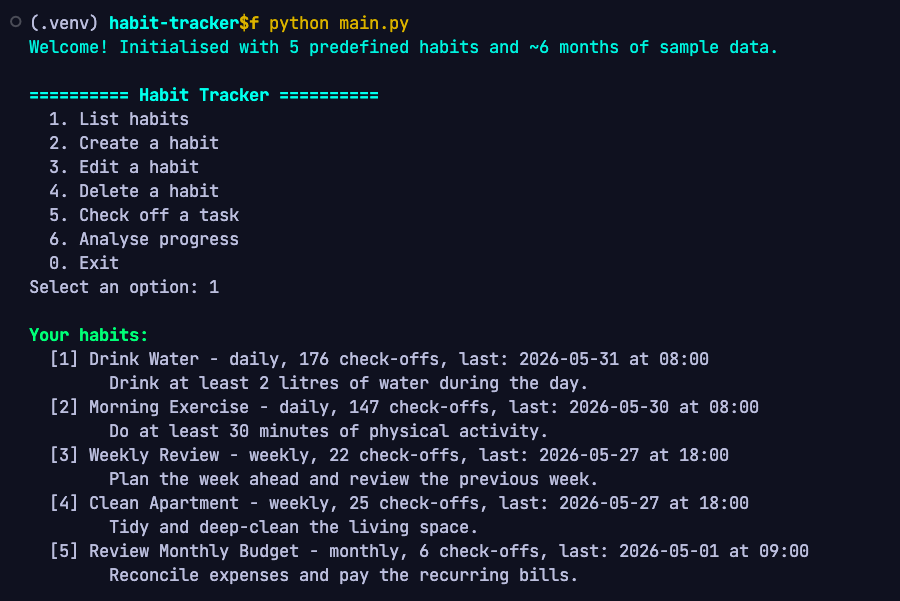
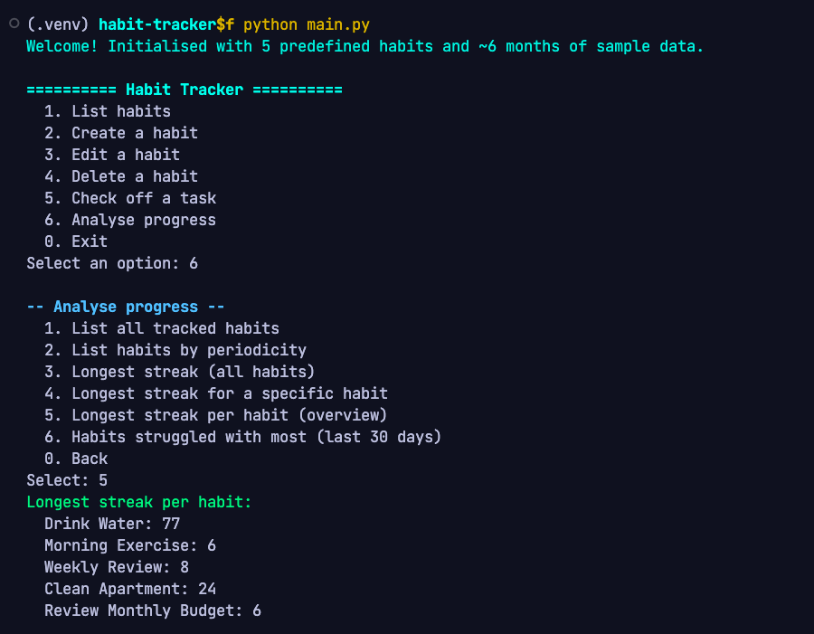
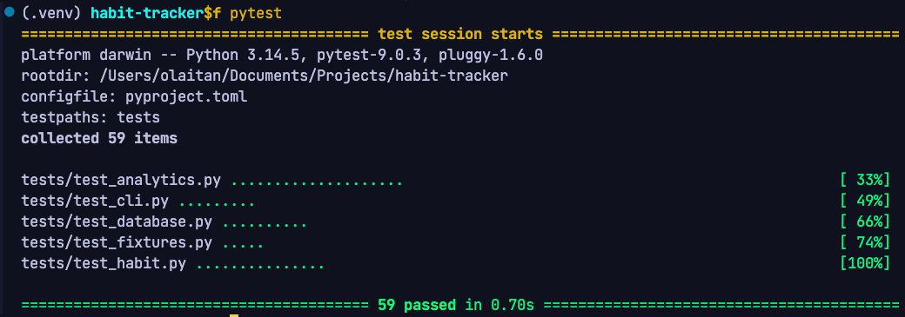

# Habit Tracker (Python Backend)


A command-line habit-tracking backend built for the IU course **Object Oriented
and Functional Programming with Python (DLBDSOOFPP01)**.

It lets a user define habits with a daily, weekly or monthly periodicity, check
them off over time, and analyse their progress — for example, *"what is my
longest streak?"* or *"which habits are weekly?"*. Habits and their full
completion history are stored in a local SQLite database so nothing is lost
between sessions.

The project deliberately demonstrates **two paradigms side by side**:

- **Object-oriented programming** models a habit as a self-contained `Habit`
  object (its state and behaviour).
- **Functional programming** powers the analytics: a set of *pure*,
  side-effect-free functions that compute insights from habit data.

---

## Contents

- [Features](#features)
- [Project structure](#project-structure)
- [Requirements](#requirements)
- [Installation](#installation)
- [Running the application](#running-the-application)
- [Predefined habits & sample data](#predefined-habits--sample-data)
- [Running the tests](#running-the-tests)
- [Screenshots](#screenshots)
- [Architecture & design notes](#architecture--design-notes)

---

## Features

- Create, list, **edit** and delete habits (daily / weekly / monthly).
- Check off a habit's task for now, or for any past date/time (24-hour clock).
- Persistent storage in SQLite (survives restarts).
- Functional analytics:
  - list all currently tracked habits,
  - list all habits with a given periodicity,
  - longest run streak across **all** habits,
  - longest run streak for **one** habit,
  - plus a per-habit streak overview and a *most-struggled-with* ranking
    (which habits you missed most over a recent window).
- Ships with **5 predefined habits** and **~6 months** of sample tracking data,
  ready to explore on first launch.
- Unit-tested with `pytest` (59 tests covering the habit model, persistence,
  the streak/break logic and the CLI).

---

## Project structure

```
habit-tracker/
├── habit_tracker/          # application package
│   ├── __init__.py
│   ├── habit.py            # OOP core: Habit class + Periodicity enum
│   ├── database.py         # SQLite persistence: DatabaseManager
│   ├── analytics.py        # functional analytics (pure functions)
│   ├── fixtures.py         # 5 predefined habits + ~6 months sample data
│   └── cli.py              # interactive command-line interface (click)
├── tests/                  # pytest suite
│   ├── conftest.py         # shared dummy-data fixtures
│   ├── test_habit.py
│   ├── test_database.py
│   ├── test_analytics.py
│   ├── test_cli.py
│   └── test_fixtures.py
├── main.py                 # entry point  ->  python main.py
├── requirements.txt
├── pyproject.toml          # pytest configuration
└── README.md
```

---

## Requirements

- **Python 3.7 or later** (developed and tested on Python 3.12 / 3.14).
- Dependencies (installed via `requirements.txt`):
  - [`click`](https://click.palletsprojects.com/) — command-line interface.
  - [`pytest`](https://docs.pytest.org/) — test runner.
- `sqlite3` is part of the Python standard library, so no database server is
  needed.

---

## Installation

**1. Clone the repository and enter the project directory**

```bash
git clone https://github.com/abdullahakintobi/habit-tracker.git
cd habit-tracker
```

**2. Create a virtual environment and install the dependencies**

*macOS / Linux:*

```bash
python3 -m venv .venv
source .venv/bin/activate
pip install -r requirements.txt
```

*Windows (PowerShell):*

```powershell
python -m venv .venv
.venv\Scripts\Activate.ps1
pip install -r requirements.txt
```

---

## Running the application

From the project root (with the virtual environment activated):

```bash
python main.py
```

On the **first run** the app creates a `habits.db` SQLite file and seeds it with
the five predefined habits and their sample data. You are then dropped into an
interactive menu:

```
========== Habit Tracker ==========
  1. List habits
  2. Create a habit
  3. Edit a habit
  4. Delete a habit
  5. Check off a task
  6. Analyse progress
  0. Exit
```

### Typical workflow

1. **Create a habit** — choose `2`, then enter a name, an optional description,
   and pick a periodicity by number (`1` daily, `2` weekly, `3` monthly).
2. **Edit a habit** — choose `3`, pick the id, then type a new name and/or
   description (press Enter at either prompt to keep the current value).
3. **Check off a task** — choose `5`, pick the habit by its id, and press Enter
   for now, or type `YYYY-MM-DD` (optionally `YYYY-MM-DD HH:MM`, 24-hour clock).
4. **Analyse progress** — choose `6` to open the analytics sub-menu and ask for
   the longest streak overall, the longest streak for a specific habit, habits
   by periodicity, and which habits you struggled with most.
5. **Delete a habit** — choose `4`, pick the id, and confirm.

Your data is saved continuously, so you can exit (`0`) and return later with
everything intact.

---

## Predefined habits & sample data

The app ships with five habits covering all three periodicities, each with a
deterministic ~6-month completion history (1 Dec 2025 – 31 May 2026). The data
is hand-designed to include realistic gaps ("breaks") so the analytics are
meaningful straight away.

| Habit                   | Periodicity | Longest streak in sample data |
|-------------------------|-------------|-------------------------------|
| Drink Water             | daily       | 77 days                       |
| Morning Exercise        | daily       | 6 days                        |
| Weekly Review           | weekly      | 8 weeks                       |
| Clean Apartment         | weekly      | 24 weeks                      |
| Review Monthly Budget   | monthly     | 6 months                      |

> A six-month window was chosen (rather than the 4-week minimum) so that the
> *monthly* habit can build a multi-period streak — four weeks is less than two
> monthly periods.

To start from a clean slate, simply delete `habits.db` and run the app again.

---

## Running the tests

From the project root (virtual environment activated):

```bash
pytest
```

The suite exercises the `Habit` model, the SQLite round-trip and cascade
delete, and — most importantly — the streak/break algorithm, including
edge cases (no completions, a single completion, multiple completions in the
same period) and streaks that cross year boundaries.

---

## Screenshots

All generated from real program output (see `screenshots/`).

**Main menu & habits** — the interactive menu and the seeded habits, each showing
its periodicity, number of check-offs, and last completion (24-hour clock):



**Analytics** — the analyse menu and the longest streak per habit:



**Unit tests** — the full `pytest` suite passing (59 tests):



---

## Architecture & design notes

**Separation of concerns.** Each responsibility lives in its own module so the
codebase stays maintainable and testable:

- `habit.py` — the `Habit` domain object. It owns its data and the `check_off`
  behaviour, but knows nothing about databases or analytics.
- `database.py` — all SQL lives here, behind `DatabaseManager`. Two normalised
  tables:

  ```sql
  habits(id, name, description, periodicity, created_at)
  tracking(id, habit_id, check_off_date)   -- FK -> habits(id) ON DELETE CASCADE
  ```

  Timestamps are stored as ISO-8601 text and parsed back into `datetime`
  objects on load.
- `analytics.py` — pure functions only. They take habit data and return a
  result without mutating anything or touching the database, which is exactly
  what the functional paradigm asks for and makes them trivial to unit-test.
- `cli.py` — a thin presentation layer (built with `click`) that wires the user
  to the database and analytics.

**Future user interfaces.** Because all logic sits behind the
`DatabaseManager` and the analytics functions, the command-line interface is
the *only* part that would need to change to add, say, a web or desktop GUI
later — the core would be reused unchanged.

**Streak definition.** A habit has a streak of *x* if its task was completed in
*x* consecutive periods. Completing a task multiple times within one period
counts once; missing a period breaks the streak. Internally each completion is
mapped to an integer "period index" (day, ISO-week or calendar-month), and the
longest run of consecutive indices is the longest streak.
